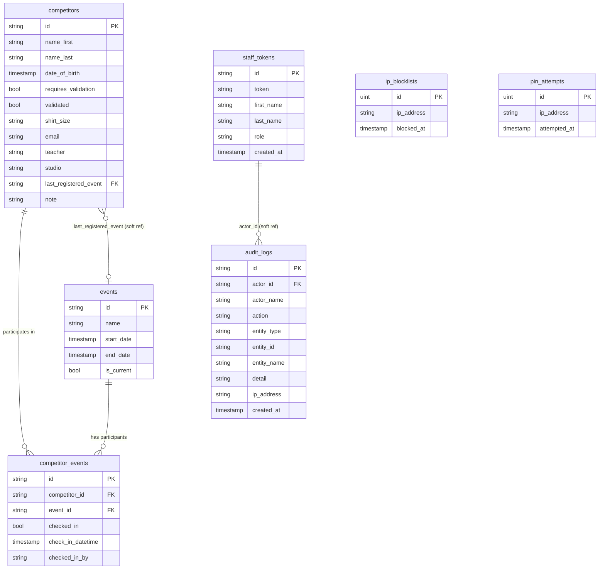

# Database

**Engine:** PostgreSQL 16  
**ORM:** GORM v1 (gorm.io/gorm with gorm.io/driver/postgres using pgx v5 under the hood)  
**Schema management:** GORM `AutoMigrate` runs on every API startup. It adds new columns and creates new tables, but never drops columns or tables.

---

## Connection

```go
func Connect(dsn string) *gorm.DB
```

Called from `main.go` with the `DATABASE_URL` environment variable. Panics (via `log.Fatal`) if the connection fails.

```go
func AutoMigrate(database *gorm.DB)
```

Migrates all 7 models on startup: `Competitor`, `Event`, `CompetitorEvent`, `AuditLog`, `IPBlocklist`, `PINAttempt`, `StaffToken`.

---

## Tables and Models

### competitors

**Go struct:** `db.Competitor`  
**File:** `internal/db/db.go`

| Column | Go type | GORM tag | Description |
|---|---|---|---|
| `id` | `string` | `primaryKey;type:uuid` | UUID, auto-generated by `BeforeCreate` hook |
| `name_first` | `string` | — | First name |
| `name_last` | `string` | — | Last name |
| `date_of_birth` | `time.Time` | — | Date of birth; zero value if unknown |
| `requires_validation` | `bool` | — | Whether staff must verify identity before check-in |
| `validated` | `bool` | — | Whether identity has been verified |
| `shirt_size` | `string` | — | T-shirt size (freeform string) |
| `email` | `string` | — | Competitor or parent email |
| `teacher` | `string` | — | Teacher name |
| `studio` | `string` | — | Studio name |
| `last_registered_event` | `string` | — | Event ID slug of most recent event; controls visibility to registration users |
| `note` | `string` | — | Internal staff note; visible to all, editable by admins only |

**Hook:** `BeforeCreate` calls `uuid.New().String()` to assign the `id`.

**JSON field names** (camelCase, as serialized by GORM/Go JSON tags):
`id`, `nameFirst`, `nameLast`, `dateOfBirth`, `requiresValidation`, `validated`, `shirtSize`, `email`, `teacher`, `studio`, `lastRegisteredEvent`, `note`

---

### events

**Go struct:** `db.Event`  
**File:** `internal/db/db.go`

| Column | Go type | GORM tag | Description |
|---|---|---|---|
| `id` | `string` | `primaryKey` | Human-readable slug (e.g. `glr-2026`); set by caller |
| `name` | `string` | `not null` | Display name (e.g. `GLR 2026`) |
| `start_date` | `time.Time` | — | Event start date |
| `end_date` | `time.Time` | — | Event end date |
| `is_current` | `bool` | `not null;default:false` | Whether this is the active event; only one should be true at a time |

**JSON field names:** `id`, `name`, `startDate`, `endDate`, `isCurrent`

---

### competitor_events

**Go struct:** `db.CompetitorEvent`  
**File:** `internal/db/db.go`

Records a competitor's participation (and check-in state) in a specific event. One row per competitor per event.

| Column | Go type | GORM tag | Description |
|---|---|---|---|
| `id` | `string` | `primaryKey;type:uuid` | UUID, auto-generated by `BeforeCreate` hook |
| `competitor_id` | `string` | `not null;uniqueIndex:idx_competitor_event` | FK to competitors.id |
| `event_id` | `string` | `not null;uniqueIndex:idx_competitor_event` | FK to events.id |
| `checked_in` | `bool` | `not null;default:false` | Whether the competitor has checked in |
| `check_in_datetime` | `*time.Time` | — | Timestamp of check-in; null for historical imports |
| `checked_in_by` | `string` | — | Staff full name at time of check-in; empty for historical imports |

**Unique index:** `idx_competitor_event` on `(competitor_id, event_id)` — enforces one row per competitor per event.

**JSON field names:** `id`, `competitorId`, `eventId`, `checkedIn`, `checkInDatetime`, `checkedInBy`

---

### audit_logs

**Go struct:** `db.AuditLog`  
**File:** `internal/db/db.go`

Immutable record of every state-changing operation.

| Column | Go type | GORM tag | Description |
|---|---|---|---|
| `id` | `string` | `primaryKey;type:uuid` | UUID, generated by `AuditService.Log` |
| `actor_id` | `string` | `index;not null` | StaffToken.ID of the actor |
| `actor_name` | `string` | `not null` | Full name of actor at time of action |
| `action` | `string` | `not null;index` | Action string, e.g. `competitor.checked_in` |
| `entity_type` | `string` | `not null;index` | `"competitor"`, `"staff_token"`, or `"event"` |
| `entity_id` | `string` | `not null;index` | UUID or slug of the affected entity |
| `entity_name` | `string` | — | Human-readable name of entity at time of action |
| `detail` (column) | `string` | `column:detail;not null;default:'{}'` | JSON text; excluded from JSON output via `json:"-"` |
| `ip_address` | `string` | — | Client IP from `GetClientIP` |
| `created_at` | `time.Time` | `index` | Time of the audit write |

**Note:** `DetailRaw` (Go field name) is tagged `json:"-"` — it is never directly serialized. The `AuditLogView` struct embeds `AuditLog` and adds a `Detail json.RawMessage` field that re-exposes `DetailRaw` as properly parsed JSON for API responses.

**JSON field names:** `id`, `actorId`, `actorName`, `action`, `entityType`, `entityId`, `entityName`, `ipAddress`, `createdAt`, `detail` (from AuditLogView only)

---

### staff_tokens

**Go struct:** `db.StaffToken`  
**File:** `internal/db/auth.go`

| Column | Go type | GORM tag | Description |
|---|---|---|---|
| `id` | `string` | `primaryKey;type:uuid` | UUID, generated by `AuthService` |
| `token` | `string` | `uniqueIndex;not null` | 64-char hex string (32 random bytes); used as Bearer token |
| `first_name` | `string` | `not null` | Staff first name |
| `last_name` | `string` | `not null` | Staff last name |
| `role` | `string` | `not null;default:'registration'` | `"registration"` or `"admin"` |
| `created_at` | `time.Time` | — | Token creation timestamp |

**JSON field names:** `id`, `token`, `firstName`, `lastName`, `role`, `createdAt`

---

### ip_blocklists

**Go struct:** `db.IPBlocklist`  
**File:** `internal/db/auth.go`

| Column | Go type | GORM tag | Description |
|---|---|---|---|
| `id` | `uint` | `primaryKey;autoIncrement` | Auto-increment integer |
| `ip_address` | `string` | `uniqueIndex;not null` | Blocked IP address |
| `blocked_at` | `time.Time` | `not null` | Time when the IP was blocked |

---

### pin_attempts

**Go struct:** `db.PINAttempt`  
**File:** `internal/db/auth.go`

| Column | Go type | GORM tag | Description |
|---|---|---|---|
| `id` | `uint` | `primaryKey;autoIncrement` | Auto-increment integer |
| `ip_address` | `string` | `index;not null` | IP address that made the attempt |
| `attempted_at` | `time.Time` | `not null` | Time of the failed attempt |

---

## Entity Relationship Diagram



---

## Relationships

### competitors → competitor_events

One-to-many. A single competitor can have one `competitor_events` row per event they have participated in. The unique index on `(competitor_id, event_id)` enforces this.

There is no GORM `HasMany` association declared on the struct — joins are done manually in service methods for performance control.

### events → competitor_events

One-to-many. Each event can have many `competitor_events` rows. No GORM association declared.

### competitors.last_registered_event → events.id

A soft reference (no foreign key constraint at the database level). `last_registered_event` stores an event slug. It is used to filter competitors visible to registration-role users (only those registered for the current event). This field is kept in sync by `CompetitorService.CheckIn` when a competitor checks in to a new event.

### audit_logs.actor_id → staff_tokens.id

A soft reference (no FK constraint). If a staff token is revoked (deleted), audit log records referencing it still exist with the `actor_id` intact, along with the `actor_name` snapshot which is always human-readable.

---

## Backup Tables (BulkImport)

Before every bulk import, the service creates two timestamped snapshot tables in the same database:

```sql
CREATE TABLE competitors_backup_<unix_timestamp> AS SELECT * FROM competitors;
CREATE TABLE competitor_events_backup_<unix_timestamp> AS SELECT * FROM competitor_events;
```

These are not cleaned up automatically. Manual cleanup is required after a successful import is verified.

---

## Related Pages

- [Backend Overview](README.md)
- [Service Layer](services.md)
- [API Reference](api.md)
