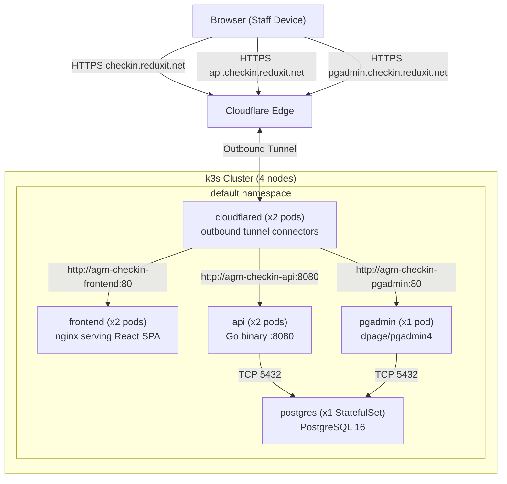

# Infrastructure Overview

AGM Check-In runs on a self-hosted k3s cluster behind a Cloudflare Tunnel. No inbound ports are exposed on the host machines — all public traffic enters via Cloudflare's edge and is forwarded outbound through cloudflared pods.

---

## Architecture Diagram

---

## k3s Cluster

The cluster is self-hosted on 4 nodes: one control plane node and three workers. All nodes are Ubuntu and accessible via SSH as `ubuntu@<hostname>`. k3s uses `containerd` as the container runtime — Docker images must be imported directly rather than pulled from a registry.

| Node SSH alias | Role |
|---|---|
| `ubuntu@k8s-cp` | Control plane (also schedules pods — k3s default) |
| `ubuntu@k8s-worker-1` | Worker |
| `ubuntu@k8s-worker-2` | Worker |
| `ubuntu@k8s-worker-3` | Worker |

Pod anti-affinity is configured on cloudflared pods to prefer different nodes, giving resilience if a single node fails.

Storage is provided by k3s's built-in `local-path` storage class. PostgreSQL uses a 5Gi PVC; pgAdmin uses a 1Gi PVC.

---

## Cloudflare Tunnel

Cloudflare Tunnel is the sole ingress mechanism. The cluster has no open inbound ports, no NodePort services for public traffic, and no LoadBalancer. Two cloudflared pods run in the cluster, each establishing an outbound connection to Cloudflare's network. If one pod dies, traffic continues through the other.

Routing is configured in the Cloudflare Zero Trust dashboard under **Networks → Tunnels → Public Hostnames**:

| Hostname | Internal Service |
|---|---|
| `checkin.reduxit.net` | `http://agm-checkin-frontend:80` |
| `api.checkin.reduxit.net` | `http://agm-checkin-api:8080` |
| `pgadmin.checkin.reduxit.net` | `http://agm-checkin-pgadmin:80` |

The service names match the Helm release name prefix (`agm-checkin`).

pgAdmin is restricted at the network level via a Cloudflare Access policy in Zero Trust. The pgAdmin hostname should have an Access application configured to require authentication before a user can reach it.

---

## Deployed Services

| Service | Kind | Replicas | Purpose |
|---|---|---|---|
| `agm-checkin-api` | Deployment | 2 | Go REST API on port 8080 |
| `agm-checkin-frontend` | Deployment | 2 | nginx serving the React SPA on port 80 |
| `agm-checkin-postgres` | StatefulSet | 1 | PostgreSQL 16 database, 5Gi PVC |
| `agm-checkin-pgadmin` | Deployment | 1 | pgAdmin4 web UI, 1Gi PVC |
| `agm-checkin-cloudflared` | Deployment | 2 | Outbound tunnel connectors |

The API has both readiness and liveness probes on `GET /health`. The postgres StatefulSet has a readiness probe using `pg_isready`.

---

## Related Pages

- [Infrastructure as Code](iac.md)
- [CI/CD Workflow](cicd.md)
- [Environments](environments.md)
- [Disaster Recovery](disaster-recovery.md)
